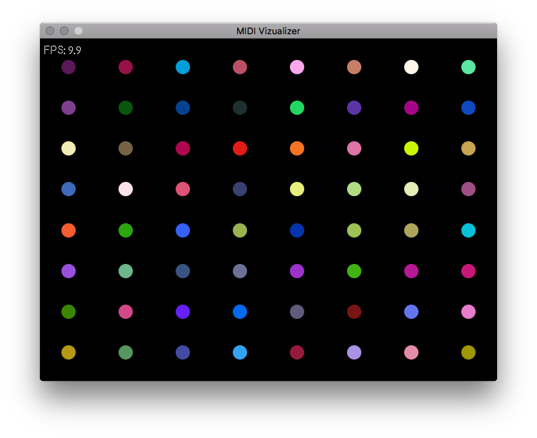

# MIDI Visualizer - Simulator



## Installation

You will need to install `socat` and [`simple2d`](http://www.ruby2d.com/learn/get-started/) before running the application. Then call `bundle install` to set up the rest.

If you are using [Homebrew](https://brew.sh) you can quickly get up and running with the following commands.

```
brew tap simple2d/tap
brew install socat simple2d
bundle install
```